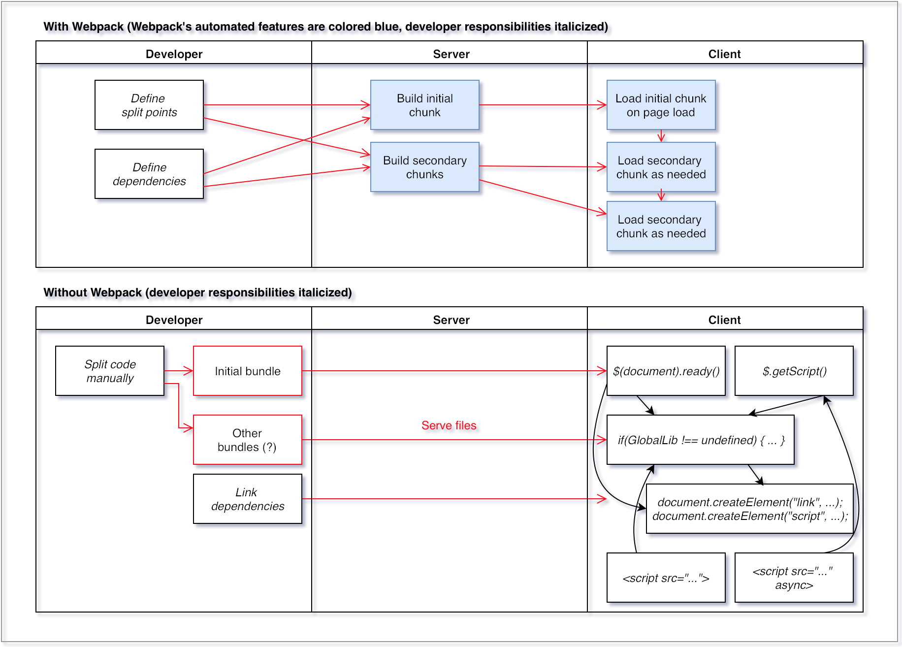

# Webpack: Diamond in the Rough

Approaching "modern" front-end development in 2016 is a daunting task, even for experienced developers. I have found one technology in my journey that simplifies things enough to belong in everyone's toolkit. That technology is Webpack.

To understand why Webpack is so valuable, we must first understand how the industry has changed over the past ten years.


If you&rsquo;re a web developer, these metrics likely come as no surprise. The modern web is an arms race of client-side functionality. As more and more bells and whistles are required for the average web page, the client-side payload gets heavier and heavier, along with the number of objects held in memory. This clogs the network connection and wears down the CPU, and on smaller devices, it can render the website completely unusable.

This is quite unfortunate when you consider another industry trend unfolding at the same time:


The chart above tracks the popularity of the top eight desktop, mobile, and tablet operating systems on the web during the past three years. Notice how much the total share of page views coming from mobile has increased in such a short amount of time.

In 2006, few expected Javascript to become such an unstoppable force in the software world. In 2009, few expected the mobile ecosystem to emerge so triumphantly and rival desktop traffic. Yet, in 2016, this is where we are.

<table class="c26">
    <tbody>
        <tr class="c21">
            <td class="c24" colspan="1" rowspan="1">
                <p class="c4"><span class="c12">Year</span>
                </p>
            </td>
            <td class="c13" colspan="1" rowspan="1">
                <p class="c4"><span class="c12">Complexity</span>
                </p>
            </td>
            <td class="c10" colspan="1" rowspan="1">
                <p class="c4"><span class="c12">Interactivity</span>
                </p>
            </td>
            <td class="c0" colspan="1" rowspan="1">
                <p class="c4"><span class="c12">Variety of compatible clients</span>
                </p>
            </td>
        </tr>
        <tr class="c21">
            <td class="c24" colspan="1" rowspan="1">
                <p class="c4"><span class="c12">2006</span>
                </p>
            </td>
            <td class="c13" colspan="1" rowspan="1">
                <p class="c4"><span class="c12">Low</span>
                </p>
            </td>
            <td class="c10" colspan="1" rowspan="1">
                <p class="c4"><span class="c12">Low</span>
                </p>
            </td>
            <td class="c0" colspan="1" rowspan="1">
                <p class="c4"><span class="c12">Large</span>
                </p>
            </td>
        </tr>
        <tr class="c21">
            <td class="c24" colspan="1" rowspan="1">
                <p class="c4"><span class="c12">2016</span>
                </p>
            </td>
            <td class="c13" colspan="1" rowspan="1">
                <p class="c4"><span class="c12">High</span>
                </p>
            </td>
            <td class="c10" colspan="1" rowspan="1">
                <p class="c4"><span class="c12">High</span>
                </p>
            </td>
            <td class="c0" colspan="1" rowspan="1">
                <p class="c4"><span class="c15 c20 c16 c25">Unimaginably huge</span>
                </p>
            </td>
        </tr>
    </tbody>
</table>

Ten years ago, the web was simple to create for, albeit offering limited interactivity. There was a handful of browsers. In contrast, web development today is very complex. If a site behaves well both on a low-resolution smart phone and on a high-resolution monitor, while still providing a pleasant user experience, it's an engineering miracle at the cost of thousands of dev hours.

As web developers, we now find ourselves in a catch-22. On the one hand, we are expected to deliver a fully rich and interactive UI, but on the other hand, we also need to cater to a range of slower, dumber devices. The key to solving this problem lies in smart asset packaging.

## Enter Webpack

There is a well-known solution to this problem by the name of progressive enhancement, in which the developer keeps the initial payload light, then gradually adds in those bells and whistles, according to what the client can handle.

Before Webpack, this was managed in a variety of different ways. You had an assortment of HTML techniques, such as script tags, async script tags, link tags, and various methods of inlining. You also had Javascript APIs, such as dynamic script tags, third-party abstractions like `$.getScript()`, you had JSONP, and `eval`. You also had a world of preprocessors to turn developer-friendly languages like CoffeeScript and SCSS into their browser-compliant counterparts.

Webpack takes a unified approach. Like *Ruby*, *Git*, and *Linux*, it adheres to a universal abstraction: everything is a *module*. No matter what type of asset you&rsquo;re must bundle, you can require it directly into your front-end code as if it were a Javascript module.

This allows Webpack to automate some of the complexity of this task, as we'll see later on in the article.

## How to load assets in Webpack

As of 2014, there were two main styles for importing Javascript modules: CommonJS and AMD. Webpack incorporates these two styles, as shown below. A new style, ES6's import syntax, became popular in 2015, which is planned for Webpack 2, but we'll leave that aside for now.

```javascript
// CommonJS:
require.ensure([“icon.png”, “stylesheet.css”], function(require) {
	var icon = require(“icon.png”);
	var stylesheet = require(“stylesheet.css”);
	…
});

// AMD:
define([“icon.png”, “stylesheet.css”], function(icon, stylesheet) {
	…
});
```

`define` and `require.ensure` are used by Webpack to draw its internal dependency tree for your system of asset files. This tree can be arbitrarily complex, and produces asset bundles ("chunks") according to a configurable set of rules.

If you run Webpack with `--display-chunks`, you will see Webpack concatenate all of your assets into a single chunk by default. This is how most people have managed large Javascript projects in the past. But ever since mobile devices have taken over the internet, that behavior is no longer optimal. That’s where split points come in.

Your split points are the points in your code where Webpack encounters a `define` or `require.ensure`. These are places where Webpack knows it can separate a piece of code into separate chunks. The genius of Webpack is that split points don’t necessarily follow file boundaries, but are entirely up to the developer; one file can have a single split point at the top, or it can have several. The result is greater flexibility in loading your assets. You can have sections of your code block the rendering of the page, while other sections load concurrently in the background. This is called progressive enhancement, a crucial technique now that you have to support a range of devices with unpredictable connectivity.

If you were to try to do this manually using the full range of static and dynamic techniques for progressive enhancement, you would end up with a mess. Webpack automates this process and gives it a predictable structure, illustrated below:



## Using complexity to simplify something even more complex

When I first heard about Webpack processing SCSS into CSS, then transforming it into JSON to be required into Javascript and inlined into HTML, my mind recoiled in horror. Why would anyone do things this way? Why not just use link tags like a person of sanity?

The answer is that Webpack assumes some complexities, like CSS preprocessors, CJS/AMD/ES6 module syntax, and asynchronous loading logic, for one simple reason: to automatically chunk interdependent assets together, no matter what they are. Once you understand this, you accept the complexity as a necessary evil in order to achieve this extremely ambitious goal.

We used Webpack's *dynamic require* feature to solve a tricky problem during the migration from Google Maps to Mapbox. On most pages, we were hiding the map behind a user click to decouple the costly Google Maps setup code from the initial page load, and used a dynamic loading snippet provided by Google to manage this process.

Mapbox does not provide a dynamic loading snippet, so writing that code became our responsibility. To make things even more complicated, Mapbox actually provides two separate libraries with different APIs, Mapbox.js and MapboxGL, depending whether the user agent supports WebGL.

The challenge quickly became: how to preserve the dynamic loading of the map code, while adding an extra feature detection step to choose the library? Webpack to the rescue!


Let's analyze the problem system by piece. In short, you have a component (the map), shown only after a user action (a click), that is dependent on one of two possible libraries chosen through feature detection (Mapbox.js or MapboxGL). This highly synchronous process is made up of a chain of practically unpredictable events, which I’ve marked with dotted lines. You don’t know when the user is going to click the button, you don’t know when the JS and CSS libraries will finish loading, and you don’t know how long the setup code will take on the user’s device. The only thing you can really guarantee is the loading of the HTML and the feature detection code. But you want each of these processes to:

1. Be in the right order.
2. Be as concurrent as possible.
3. Happen only once.

In the past, you might solve this problem with dynamic loading techniques like passing callbacks, dynamically creating script tags, keeping track of state through booleans scattered throughout your code, and so on. You might end up with a sloppy state machine scattered across about 5 files that is still slow and vulnerable to race conditions. In fact, this describes our first pass.

But by virtue of its universal abstraction, Webpack handles all this for you. All you have to do is specify which sections of code depend on which modules, using split points. 

The code below is very similar to our real solution using Webpack:

```javascript
define([
    'mapbox-gl-supported'
 ], function(
    isMapboxGlSupported
 ) {

    // the function that will load the map code and initialize
    // the map, or if the map code has been loaded, just
    // initialize the map.
    var loadAndInitMap;

    // feature detection -- webGL detected.
    if(isMapboxGlSupported()) {

        // here is where we make the initialization dependent
        // on the loading of MapboxGL.
        loadAndInitMap = function() {
            require(['mapbox-gl'], function(initMap) {
                initMap();
            });
        };

        // once feature detection is complete, go ahead and start
        // loading the MapboxGL library in the background. The
        // inner initMap function is not called because we are
        // saving it for when the user clicks.
        require(['mapbox-gl'], function(initMap) {});

    // feature detection -- webGL not detected.
    } else {

        // here is where we make the initialization dependent
        // on the loading of Mapbox.js.
        loadAndInitMap = function() {
            require(['mapbox.js'], function(initMap) {
                initMap();
            });
        };

        // once feature detection is complete, go ahead and start
        // loading the Mapbox.js library in the background. The
        // inner initMap function is not called because we are
        // saving it for when the user clicks.
        require(['mapbox.js'], function(initMap) {});
    }

    // the user click will initialize the map, but wait until the 
    // correct library has been loaded.
    $(".map-container").click(loadAndInitMap);
});
```

Looks like regular Javascript written in the AMD style, right? It is, but Webpack has repurposed `require()` to define a split point, or a break in the synchronous flow of the code where assets can be split into separate chunks.

In the words of an age gone by, "Look at all the things I'm *NOT* doing!" I'm not...

* keeping track of when libraries are loaded.
* making sure libraries are not loaded more than once.
* worrying about race conditions.

Pretty cool, huh?

## Set your publicPath

There is one slight caveat with this technique, and that comes into play when you are using a CDN to deliver your assets.

When using Webpack’s dynamic require as shown above, Webpack will automatically insert the necessary code into your app bundle to fetch and evaluate the deferred sections of code. This means Webpack needs to know the URL from which to pull this code, or else it will attempt to pull it by default from the relative root path. [The way to specify this is via the publicPath.](https://github.com/webpack/docs/wiki/configuration#outputpublicpath)

This only becomes a concern once you use dynamic requires as shown above. Not every Webpack configuration will have the publicPath specified. Whenever you use this technique, you should be sure to check to make sure the publicPath is properly set.

## Conclusion

Asset delivery is not an area most front-end developers focus on. This is because, with the set of ad-hoc techniques we're accustomed to, creating a progressively enhanced client-side app is far more trouble than it's worth. Webpack simplifies this to the extent that any dev can now exercise full control over when and where their code gets loaded.

I don’t know enough about Webpack yet to guarantee that it won’t be made obsolete by some other tool within the next couple of years. But, I do know enough to say that mastering a tool like Webpack will pay off many times in the long run if you are heavily invested in developing for the web platform.

Like Rails in 2009, Webpack is a mature technology outside the mainstream that has nonetheless attracted a community of highly productive people and created its own niche. I’m excited to learn Webpack and look forward to see what comes of it.

## References

* http://www.yottaa.com/company/blog/application-optimization/a-brief-history-of-web-page-size/
* https://medium.com/@rajaraodv/webpack-the-confusing-parts-58712f8fcad9#.xm9oh8m87
* https://webpack.github.io/docs/code-splitting.html
* https://github.com/webpack/docs/wiki/shimming-modules

<script data-codementor="tylerboyd" data-style="badge" data-theme="light" src="https://cdn.codementor.io/assets/badge.js"></script>
