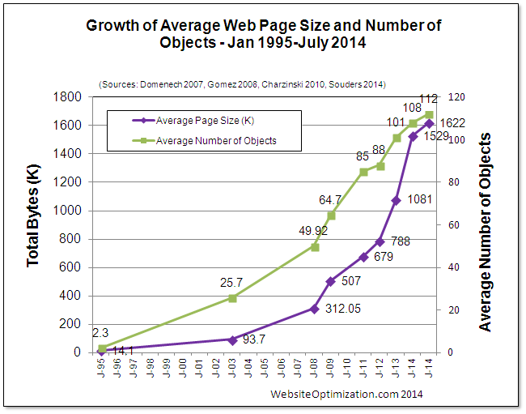
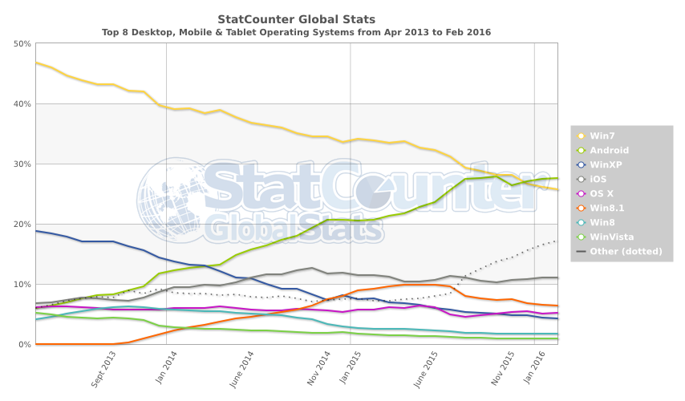
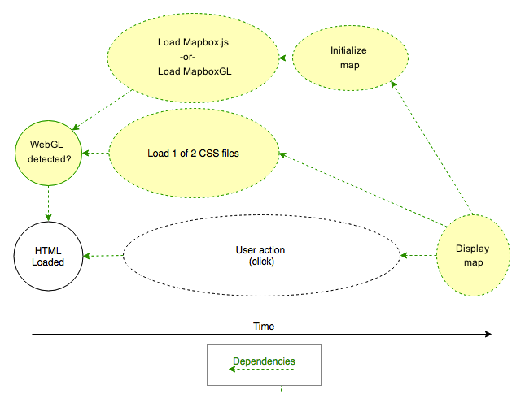

# Webpack: A Tool for the Modern Age

A modern web page is a sizeable and complex tangle of content and technology. As evidence, page size (measured in kilobytes) has more than doubled in the recent past, while the number of page objects has steadily increased. The chart below shows both trends between the early days of the web and 2014.



If you&rsquo;re a web developer, these metrics likely come as no surprise. Indeed, you may argue that &ldquo;web page&rdquo; is something of a misnomer. Instead, &ldquo;Application&rdquo; is an increasingly apt description of what&rsquo;s delivered to so many browsers. A click can ultimately require megabytes of *HTML*, *CSS*, and *JavaScript*. Web developers face far greater challenges than even five years ago, as summarized in the next table.

<table class="c26">
    <tbody>
        <tr class="c21">
            <td class="c24" colspan="1" rowspan="1">
                <p class="c4"><span class="c12">Year</span>
                </p>
            </td>
            <td class="c13" colspan="1" rowspan="1">
                <p class="c4"><span class="c12">Complexity</span>
                </p>
            </td>
            <td class="c10" colspan="1" rowspan="1">
                <p class="c4"><span class="c12">Interactivity</span>
                </p>
            </td>
            <td class="c0" colspan="1" rowspan="1">
                <p class="c4"><span class="c12">Variety of compatible clients</span>
                </p>
            </td>
        </tr>
        <tr class="c21">
            <td class="c24" colspan="1" rowspan="1">
                <p class="c4"><span class="c12">2006</span>
                </p>
            </td>
            <td class="c13" colspan="1" rowspan="1">
                <p class="c4"><span class="c12">Low</span>
                </p>
            </td>
            <td class="c10" colspan="1" rowspan="1">
                <p class="c4"><span class="c12">Low</span>
                </p>
            </td>
            <td class="c0" colspan="1" rowspan="1">
                <p class="c4"><span class="c12">Large</span>
                </p>
            </td>
        </tr>
        <tr class="c21">
            <td class="c24" colspan="1" rowspan="1">
                <p class="c4"><span class="c12">2016</span>
                </p>
            </td>
            <td class="c13" colspan="1" rowspan="1">
                <p class="c4"><span class="c12">High</span>
                </p>
            </td>
            <td class="c10" colspan="1" rowspan="1">
                <p class="c4"><span class="c12">High</span>
                </p>
            </td>
            <td class="c0" colspan="1" rowspan="1">
                <p class="c4"><span class="c15 c20 c16 c25">Unimaginably huge</span>
                </p>
            </td>
        </tr>
    </tbody>
</table>

Ten years ago, the web was simple to create for, albeit offering limited interactivity. There was a handful of browsers. In contrast, web development today is very complex. Browser-based computing continues to supplant most other forms of computing, including the desktop, having reached parity in features and interactivity. Further, the number of clients consuming the web is inordinate, including many browsers and a host of mobile clients that did not exist a decade ago.

The chart below tracks the poularity of the top eight desktop, mobile, and tablet operating systems during the past three years.  



It is remarkable that a site can behave well both on a low-resolution smart phone and on a high-resolution monitor. Remarkable for the user, yes. Fun for the developer? Hardly.

[Ed.: There likely needs to be a bridge here between this notion and Webpack. What are the problems that Webpack solves? Can those problems be tied to what was just said?]

*Webpack* is indispensable for developing modern, responsive, and full-featured web pages. It gives you unprecedented power to control asset delivery.


## Enter Webpack

[Ed: Is there a brief explanation of what it does and how it works that could be inserted here?]

Webpack, like *Ruby*, *Git*, and *Linux*, adheres to a universal abstraction: everything is a *module*. No matter what type of asset you&rsquo;re must bundle, you can require it directly into your Javascript using whatever method you like.

[Ed.: What is the workflow like without Webpack? What are the differences between CommonJS and AMD? Spell out what AMD stands for. Would it be helpful to show an example with real collection of assets?]

CommonJS:

```javascript
require.ensure([“icon.png”, “stylesheet.css”], function(require) {
	var icon = require(“icon.png”);
	var stylesheet = require(“stylesheet.css”);
	…
});
```

AMD:

```javascript
define([“icon.png”, “stylesheet.css”], function(icon, stylesheet) {
	…
});
```

`define` and `require.ensure` are the signals [Ed.: Is `signals` the best word to use here?] Webpack uses to draw its internal dependency tree for your system of asset files. This tree can be arbitrarily complex, and produces fruits called chunks.

A chunk is a bundle of Javascript that contains a set of asset files. If you run Webpack with `--display-chunks`, you will see Webpack concatenate all of your assets into a single chunk by default. This is how most people have managed large Javascript projects in the past. But ever since mobile devices have taken over the internet, that behavior is no longer optimal. That’s where split points come in.

Your split points are the points in your code where Webpack encounters a define or require.ensure. These are places where Webpack knows it can separate a piece of code into separate chunks. The genius of Webpack is that split points don’t necessarily follow file boundaries, but are entirely up to the developer; one file can have a single split point at the top, or it can have several. The result is greater flexibility in loading your assets. You can have sections of your code block the rendering of the page, while other sections load concurrently in the background. Again, this is crucial in 2016 when you have to support a range of devices with unpredictable connectivity.

[Ed.: A diagram showing the Webpack worflow and input and output could be helpful. The diagram might show all of the possible transformations supported, such as changing SCSS to CSS, etc.]


## Using complexity to simplify something even more complex

When I first heard about Webpack processing SCSS into CSS, then transforming it into JSON to be required into Javascript and inlined into HTML, my mind recoiled in horror. Why would anyone do things this way? Why not just use link tags like a person of sanity?

The answer is that Webpack assumes some complexities, like CSS preprocessors, CJS/AMD/ES6 module syntax, and asynchronous loading logic, for one simple reason: to automatically chunk interdependent assets together, no matter what they are. Once you understand this, you accept the complexity as a necessary evil in order to achieve this extremely ambitious goal.

For example, say your site’s assets are arranged in this dependency graph:



In short, you have a component, shown only after a user action, that is dependent on one of two possible libraries chosen through feature detection. This highly synchronous process is made up of a chain of practically unpredictable events, which I’ve marked with dotted lines. You don’t know when the user is going to click the button, you don’t know when the JS and CSS libraries will finish loading, and you don’t know how long the setup code will take on the user’s device. The only thing you can really guarantee is the loading of the HTML and the feature detection code. But you want each of these processes to:

1. Be in the right order.
2. Be as concurrent as possible.
3. Happen only once.

In the past, you might solve this problem with dynamic loading techniques like passing callbacks, dynamically creating script tags, keeping track of state through booleans scattered throughout your code, and so on. You might end up with a sloppy state machine scattered across about 5 files that is still slow and vulnerable to race conditions.

[Ed.: Does this problem statement belong further up to help motivate why Webpack is a better solution? Once you explain the problem and how bad the normal solution is, why does Webpack address it?]

Here’s an optimal solution using Webpack:

```javascript
define([
    'jquery',
    'feature-detect'
 ], function(
    $,
    featureDetect
 ) {
    var clickedComponent;

    if(featureDetect()) {
        clickedComponent = function() {
           require(['setup-component-1'], function(setupComponent) {
               setupComponent();
           });
       };
       require(['setup-component-1'], function(setupComponent) {});
    } else {
       clickedComponent = function() {
           require(['setup-component-2'], function(setupComponent) {
               setupComponent();
           });
       };
       require(['setup-component-2'], function(setupComponent) {});
   }

   $("button.display-component").click(clickedComponent);
});
```

Looks like regular Javascript written in the AMD style, right? It is, but Webpack has repurposed `require()` to define a split point, or a break in the synchronous flow of the code where assets can be split into separate chunks.

But this doesn’t mean you have to write in AMD or limited to libraries written in AMD. Webpack also supports CommonJS-style modules, as well as modules that interact with globally scoped objects like `window`. Webpack even supports modules that use AMD or CommonJS incorrectly. You can mix and match all of these types of libraries in one code base, while writing your app code the way you prefer.


## Set your publicPath

There is one slight caveat with this technique, and that comes into play when you are using a CDN to deliver your assets.

When using Webpack’s dynamic require as shown above, Webpack will automatically insert the necessary code into your app bundle to fetch and evaluate the deferred sections of code. This means Webpack needs to know the URL from which to pull this code, or else it will attempt to pull it by default from the relative root path. [The way to specify this is via the publicPath.](https://github.com/webpack/docs/wiki/configuration#outputpublicpath)

This only becomes a concern once you use a dynamic require, so not every Webpack configuration will have the publicPath specified. Whenever you use this technique, you should be sure to check to make sure the publicPath is properly set.


## Conclusion

[Ed.: When should a developer use Webpack? When to avoid it? Any evidence of time saved with it? ]

I don’t know enough about Webpack yet to guarantee that it won’t be made obsolete by some other tool within the next couple of years. But, I do know enough to say that mastering a tool like Webpack will pay off many times in the long run if you are heavily invested in developing for the web platform. Even if Webpack stays in the margins of the Javascript community, its innovative principles will guide the design of its own future usurpers.

Like Rails in 2009, Webpack is a mature technology outside the mainstream that has nonetheless attracted a community of highly productive people and created its own niche. I’m excited to learn Webpack and look forward to see what comes of it.


## References

* http://www.yottaa.com/company/blog/application-optimization/a-brief-history-of-web-page-size/
* https://medium.com/@rajaraodv/webpack-the-confusing-parts-58712f8fcad9#.xm9oh8m87
* https://webpack.github.io/docs/code-splitting.html
* https://github.com/webpack/docs/wiki/shimming-modules

<script data-codementor="tylerboyd" data-style="badge" data-theme="light" src="https://cdn.codementor.io/assets/badge.js"></script>

[Ed.: What are the alternatives to Webpack? Why would you use one of those and not the othr?]
